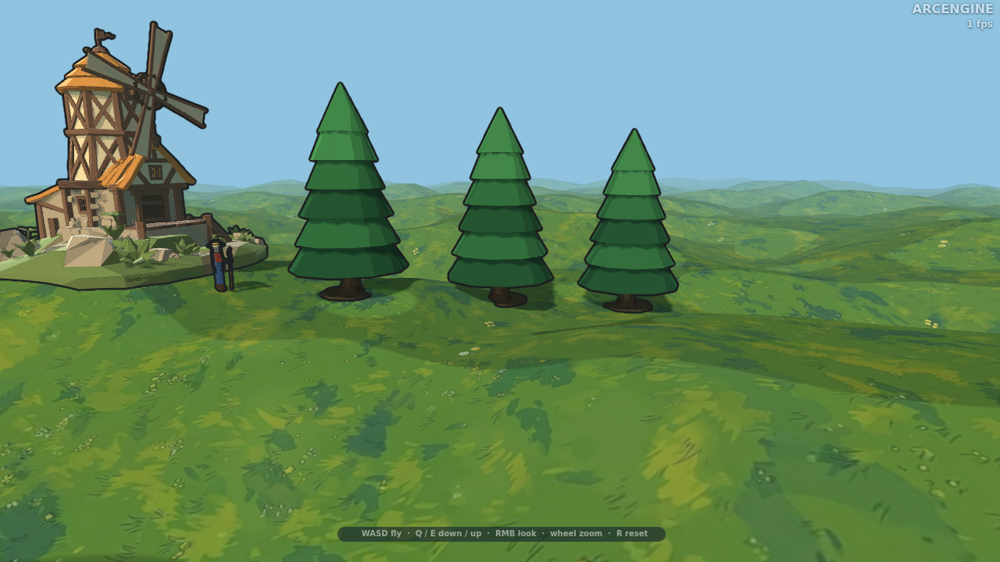
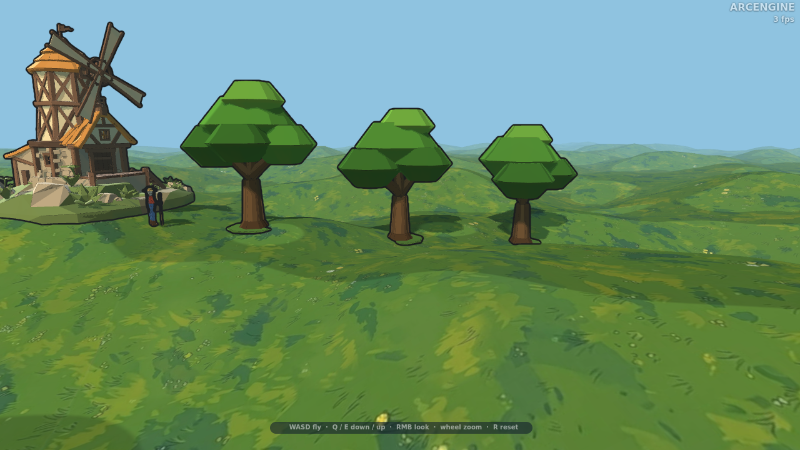
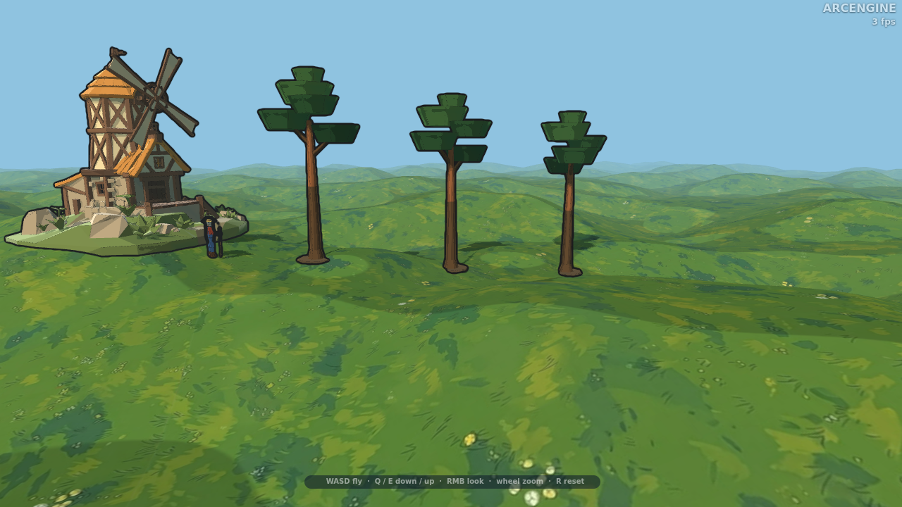
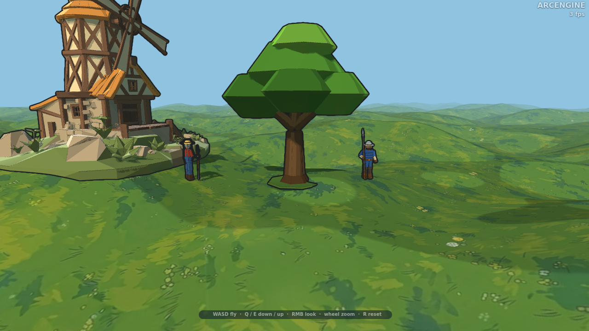
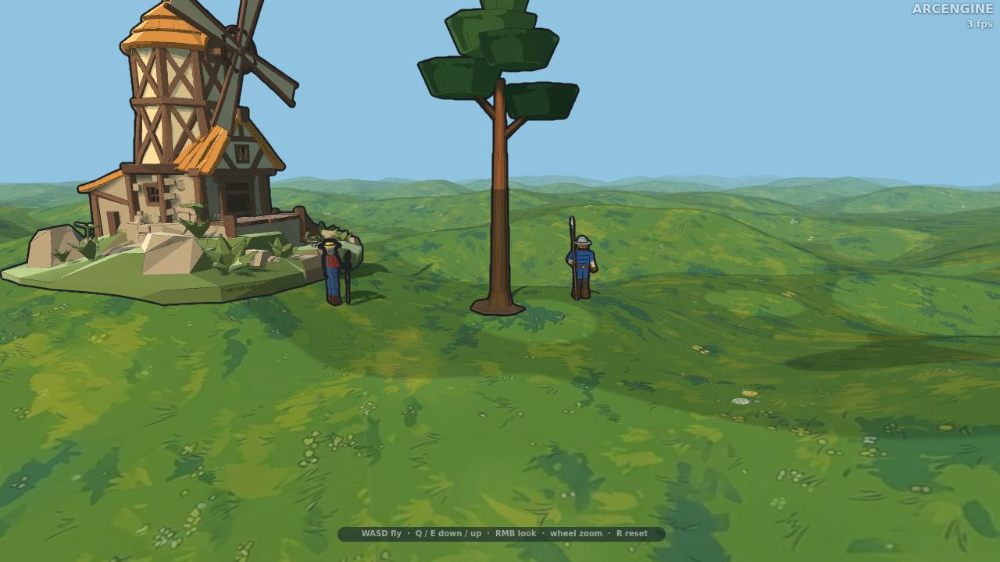
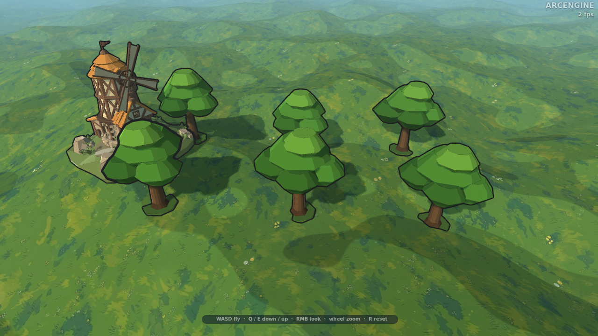
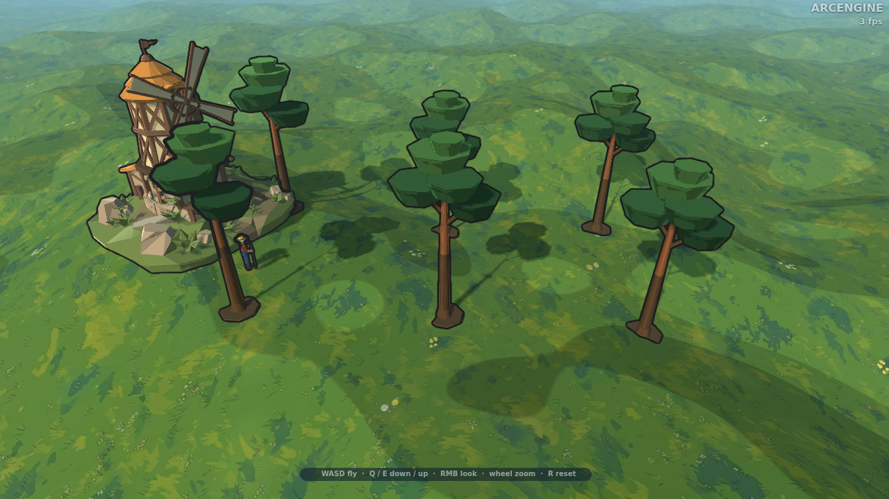
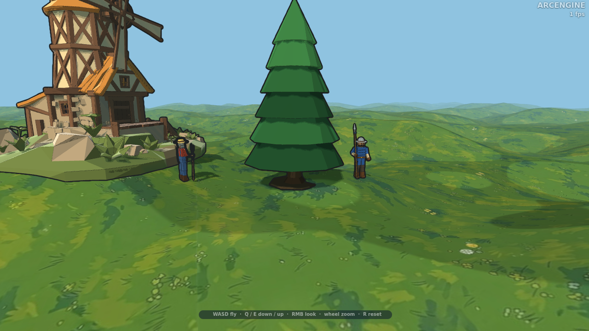
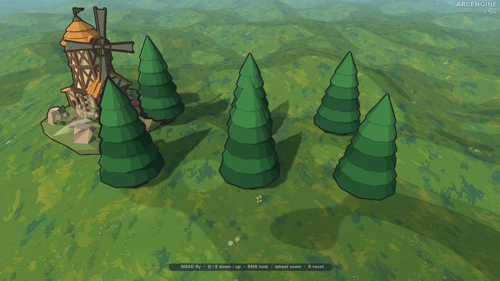

# 3D-модели растений

Low-poly модели деревьев в том же стиле, что и юниты, здания и укрепления: один GLB, **один меш и
один материал** (цвета — крошечная текстура-палитра, 4×4), один draw call. Статичные: ни скелета,
ни клипов.

| Файл | Растение | Треугольники | Цвета |
|---|---|---|---|
| `spruce.glb` | ель высотой **7,7 м**: ствол с утолщением у корней, шесть десятигранных конусов-ярусов (радиус от 2,2 м внизу до 0,9 м наверху, каждый повёрнут на 18° относительно нижнего), острая верхушка, пятно хвойной подстилки у корней. Нижние ярусы темнее, верхние светлее | 320 | 6 из 16 |
| `oak.glb` | дуб высотой **6,9 м**, крона около **6,3 × 5,5 м**: толстый конусный ствол с утолщением у корней, три развилки-сука и пять кругловатых «шапок» листвы (восьмигранные двойные усечённые конусы) трёх оттенков зелёного, на пятне травы | 472 | 6 из 16 |
| `pine.glb` | сосна высотой **8,7 м**, крона около 4,4 м: высокий голый ствол (выше середины — рыжая кора), два коротких сука и пять плоских неровных «подушек» хвои наверху. Тонкая и высокая: отличается и от ели (конус), и от дуба (круглая крона) | 284 | 6 из 16 |



















Метры, +Y вверх, начало координат — на земле в центре ствола. Дерево круглое вокруг Y, поэтому
поворот не важен: для разнообразия леса достаточно случайного поворота и масштаба 0,8–1,2.

## В ArcEngine

Как здания (см. [`../3D-models-buildings/README.md`](../3D-models-buildings/README.md)): файл в
`assets/models/`, `Model3D.load` + `Model3D.build` + `World3D.addObject(view, mesh, 'prop')`. Лес —
сотни одинаковых деревьев: `World3D.addInstances(view, mesh, 'prop', items)`, один draw call.

## Как меняются модели

Модели генерируются кодом, руками файлы не правятся. Описание — `tools/plants/spruce.mjs`, `oak.mjs`, `pine.mjs`
(поле `folder: '3D-models-plants'`), сборщик — `tools/make-buildings.mjs`:

```
node tools/make-buildings.mjs spruce                   # пересобрать (также oak, pine)
node tools/make-buildings.mjs --check                  # файлы совпадают с генератором?
node tools/unit-preview.mjs spruce                     # previews/spruce.png
node tools/unit-preview.mjs spruce --squad --out=3D-models/3D-models-plants/previews/spruce-squad.png
node tools/unit-preview.mjs spruce --with=spearman --pose=0 --out=3D-models/3D-models-plants/previews/spruce-spearman.png
```
