# 3D-модели юнитов

Low-poly модели юнитов для стратегии в духе Diplomacy is Not an Option. Каждая модель — один
GLB со скелетом и клипами анимации, **один меш и один материал** (цвета — крошечная текстура-палитра),
то есть один draw call на юнит: сотни юнитов на экране не упираются в процессор.

| Файл | Юнит | Треугольники | Кости | Клипы |
|---|---|---|---|---|
| `swordsman.glb` | мечник: шлем с наносником, кольчуга, синяя котта с золотым крестом, круглый щит, меч | 756 | 13 | `idle`, `run`, `attack`, `death`, `ride`, `rideRun` |
| `archer.glb` | лучник: капюшон и оплечье цвета команды, оливковая туника, колчан за спиной, длинный лук, тетива которого тянется за рукой | 712 | 14 | `idle`, `run`, `attack`, `death` |
| `spearman.glb` | копейщик: шапель (шлем с широкими полями), стёганка цвета команды, борода, копьё 2,6 м двумя руками | 684 | 12 | `idle`, `run`, `attack`, `death` |
| `orc.glb` | орк: зелёная кожа, клыки, ирокез, шипастые оплечья и перевязь цвета команды, двуручный топор 1,9 м. Выше человека на голову (2,0 м) | 736 | 12 | `idle`, `run`, `attack`, `death` |
| `goblin.glb` | гоблин-копьеметатель: большая голова и уши, длинный нос, повязка и туника цвета команды, связка запасных дротиков за спиной, дротик 1,5 м. Рост 1,6 м | 700 | 12 | `idle`, `run`, `attack`, `death` |
| `troll.glb` | тролль: сутулый великан 2,5 м, серо-зелёная кожа, клыки и рожки, оплечья и перевязь цвета команды, огромная шипастая дубина | 784 | 12 | `idle`, `run`, `attack`, `death` |
| `horse.glb` | верховая лошадь без всадника: гнедая, тёмные грива и хвост, белая проточина и «носочки», попона цвета команды с золотой каймой, кожаное седло со стременами; кость `saddle` — куда сажать всадника. Высота в холке 1,5 м, длина 2,3 м | 556 | 13 | `idle`, `run` |

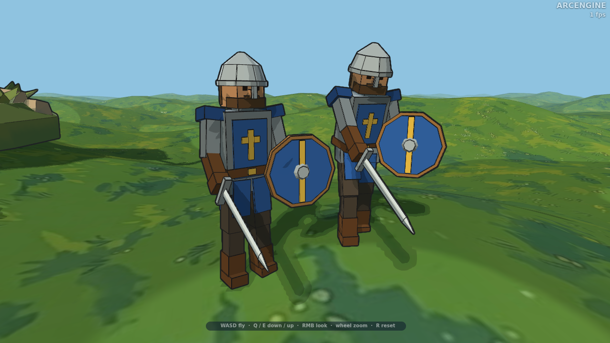

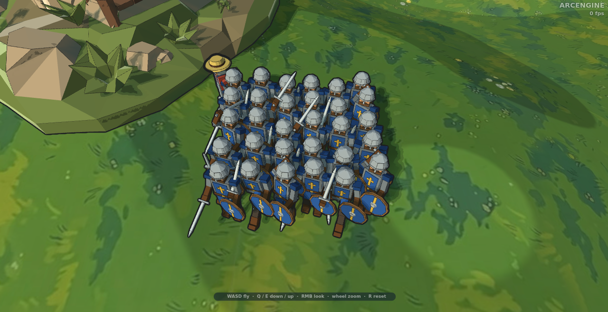

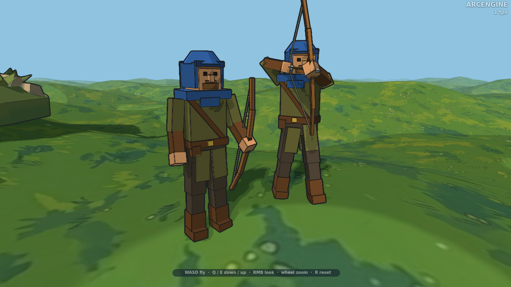

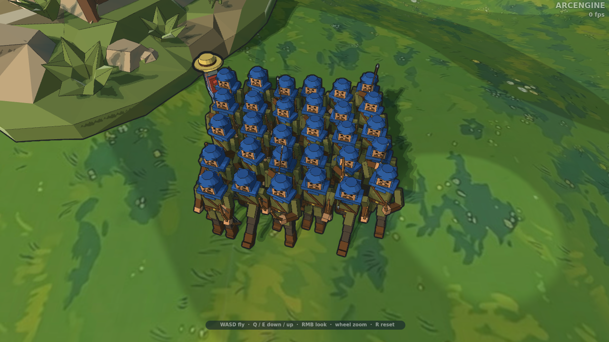

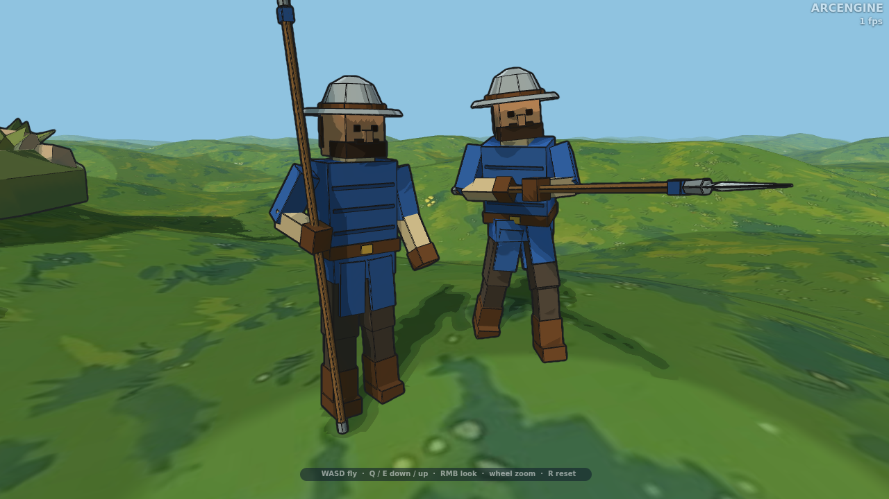

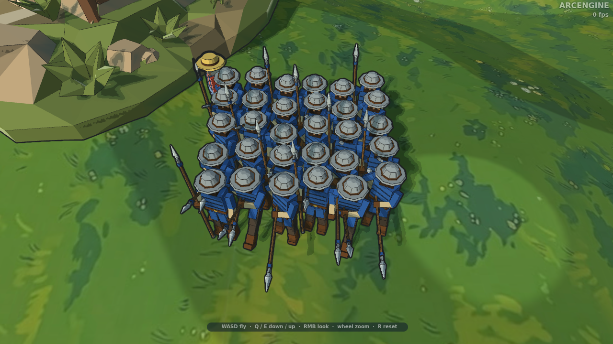

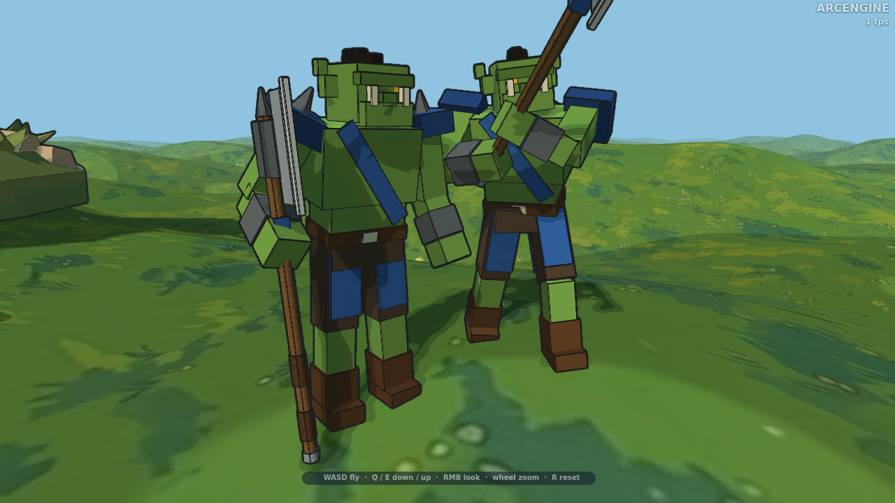

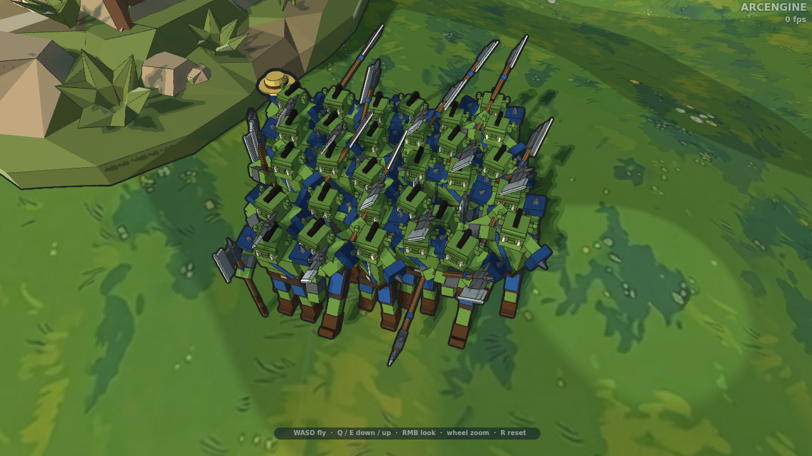

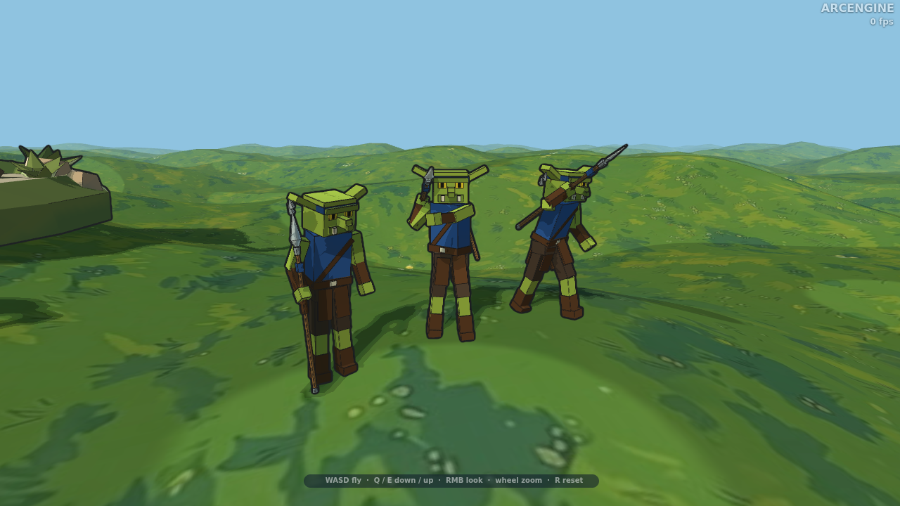

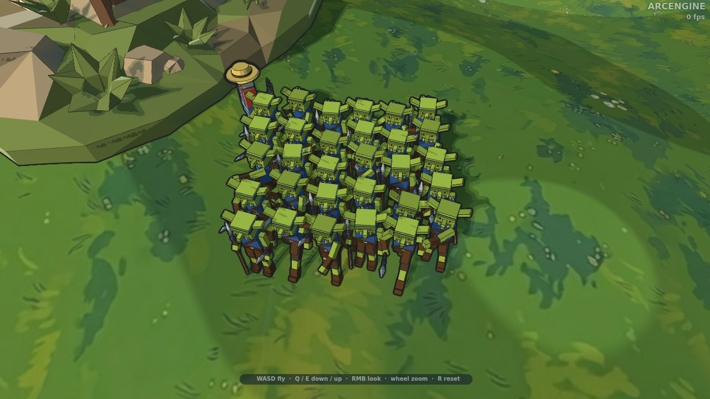

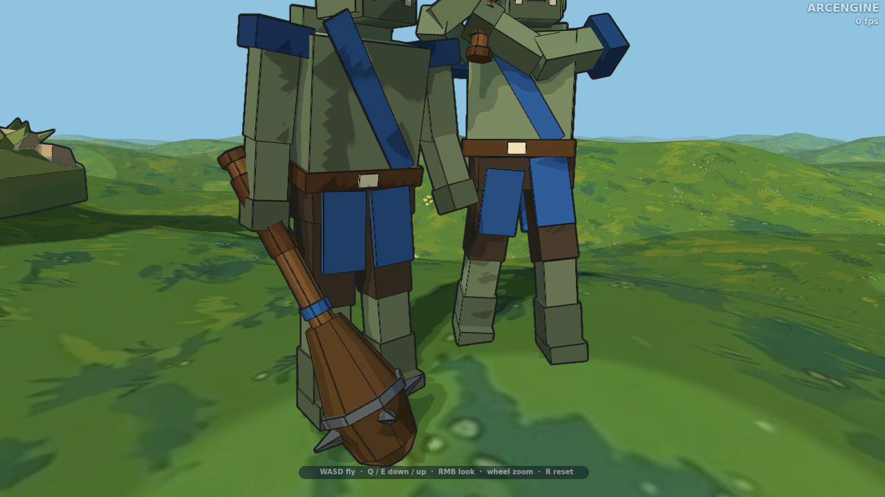

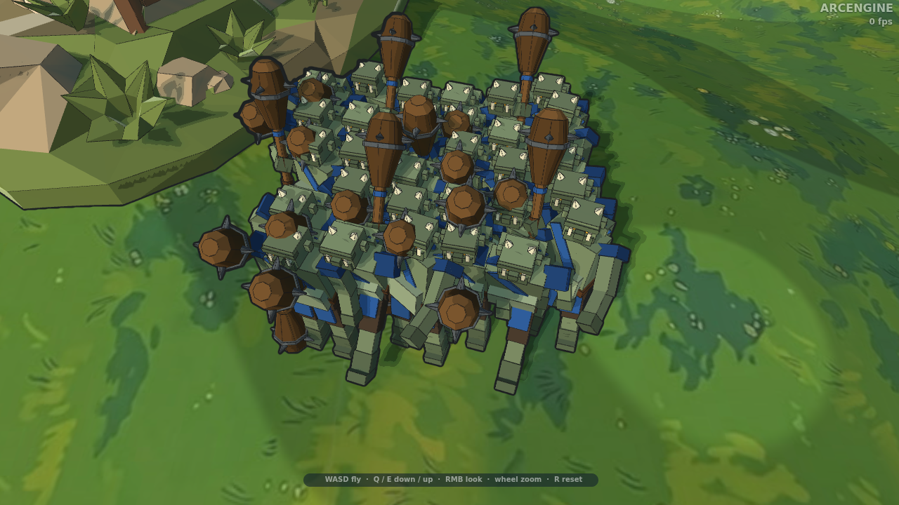

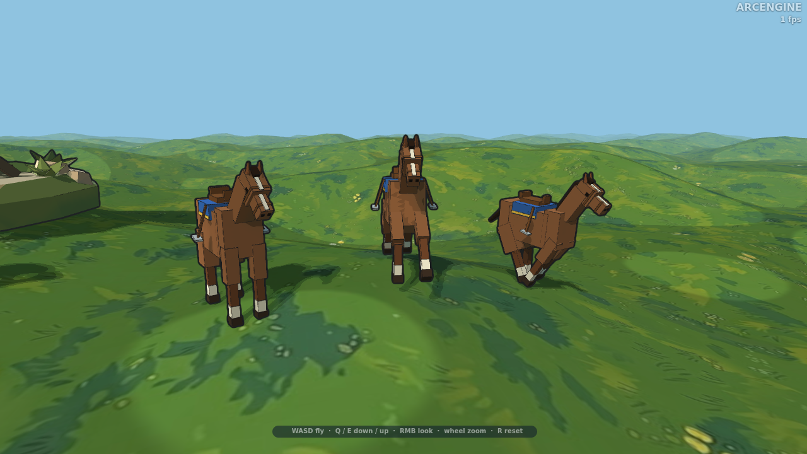

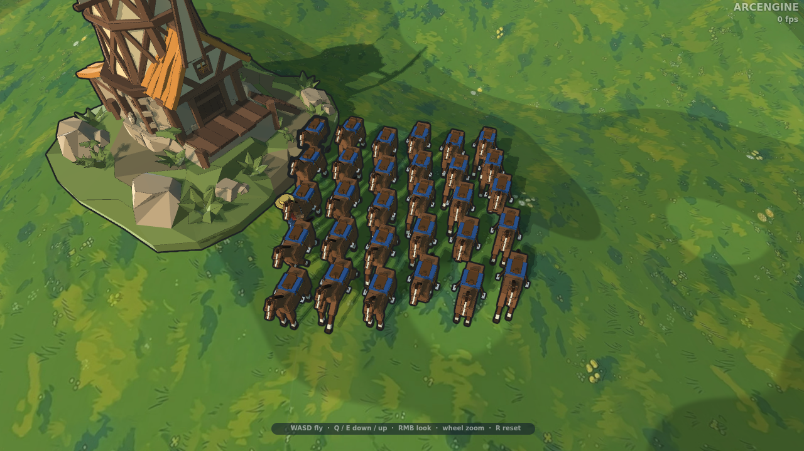

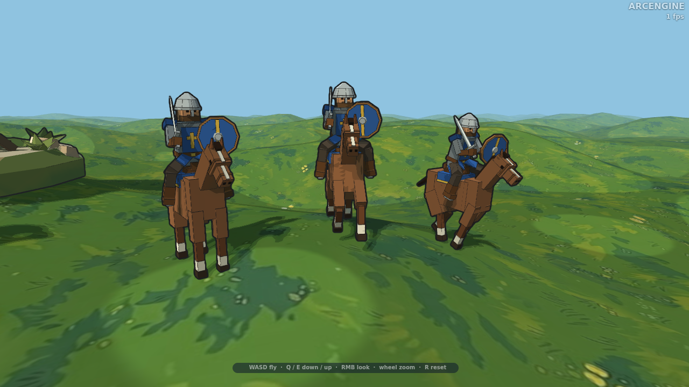

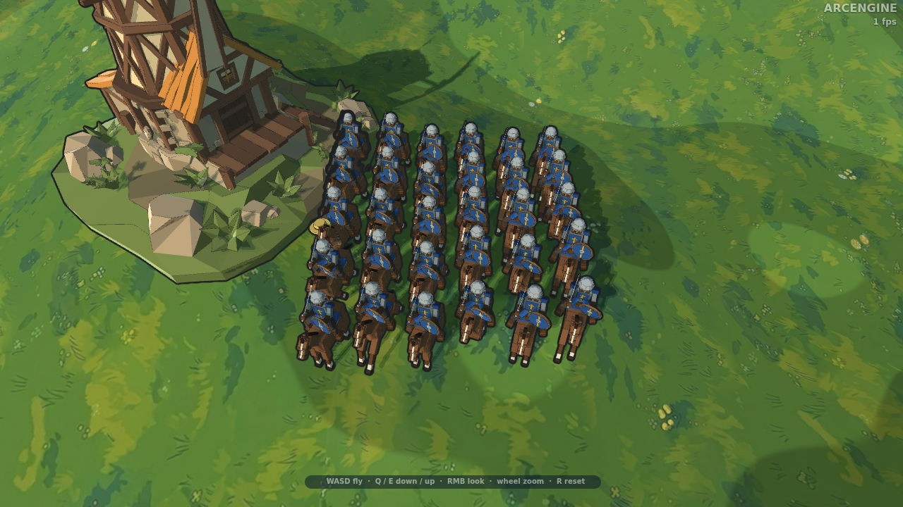

Рост людей — 1,75 м (с головным убором до 1,89), орка — 2,0 м (с ирокезом 2,03), гоблина — 1,6 м (кончики ушей), тролля — 2,5 м (рожки), лошади — 1,5 м в холке и 2,1 м до ушей, метры, +Y вверх, лицом к +Z (стандарт glTF).
Открывается в Blender, Unity, Godot и любом просмотрщике glTF.

## Клипы

У всех юнитов одни и те же имена клипов, поэтому код игры для них один. `idle`, `run` и `attack`
идут по кругу, `death` играется один раз, и юнит остаётся лежать. Исключения: у лошади только `idle`
и `run`; у мечника есть ещё `ride` и `rideRun` (см. «Всадник на лошади»).

| Клип | Мечник | Лучник | Копейщик | Орк | Гоблин | Тролль |
|---|---|---|---|---|---|---|
| `idle` | меч остриём вниз, щит у бедра | лук опущен у левого бока | копьё стоит упором в землю | топор стоит обухом в землю у правого бока | дротик стоит в руке, гоблин озирается | дубина лежит головой на земле, тяжёлое дыхание |
| `run` | щит перед собой, меч поднят | лук качается в левой руке | копьё наискось вперёд, двумя руками | топор наискось поперёк груди, двумя руками | дротик наискось вперёд, быстрая перебежка | дубина двумя руками поперёк груди, тяжёлая поступь |
| `attack` | замах и косой удар, 0,9 с | стрела из колчана, натяжение, выстрел, 1,5 с | отвод и укол с выпадом, 1,0 с | замах над плечом и рубящий удар сверху с выпадом, 1,1 с | замах и бросок: дротик исчезает в момент выпуска из руки, новый появляется из связки за спиной, 0,9 с | дубина двумя руками над головой и удар сверху с выпадом, 1,4 с |
| `death` | падает на спину | падает на спину, лук вдоль тела | падает на спину, копьё вдоль тела | падает на спину, топор вдоль тела | падает на спину, дротик вдоль тела | падает на спину, дубина вдоль тела |

## Всадник на лошади

У лошади только `idle` и `run`. Всадник — отдельная модель (мечник), он садится на кость `saddle`
лошади и едет вместе с ней: поза посадки — клипы мечника `ride` (стоит) и `rideRun` (скачет,
наклон вперёд, колени пружинят). Масштаб и направление задаются лошади, всаднику — только клипы.

```js
const horse = Model3D.build(await Model3D.load('assets/models/horse.glb', view.scene), view.scene, { name: 'horse' });
const rider = Model3D.build(await Model3D.load('assets/models/swordsman.glb', view.scene), view.scene, { name: 'rider' });
World3D.addObject(view, horse, 'actor');
World3D.addObject(view, rider, 'actor');
horse.scaling.setAll(0.25);
Model3D.mount(rider, horse, 'saddle');              // false — у лошади нет такой кости
const moving = true;
Model3D.clips(horse).play(moving ? 'run' : 'idle');
Model3D.clips(rider).play(moving ? 'rideRun' : 'ride');
Model3D.dismount(rider);                            // слезть: остаётся на месте в мире
```

Перед `Model3D.dispose` лошади всадника снимают (`dismount`), иначе он удалится вместе с ней.
Снимок: `node tools/unit-preview.mjs horse --rider=swordsman`.

## В ArcEngine

Скопировать файл в `assets/models/` (путь к ассету в коде — литералом `'assets/…'`, иначе сборщик
его не увидит) и расставить во вкладке Objects редактора или из кода:

```js
const model = await Model3D.load('assets/models/swordsman.glb', view.scene);
const unit = Model3D.build(model, view.scene, { name: 'swordsman' });
World3D.addObject(view, unit, 'actor');
unit.scaling.setAll(0.25);                          // как персонаж набора
unit.position.set(x, terrain.heightAt(x, y), y);
const clips = Model3D.clips(unit);
clips.play(moving ? 'run' : 'idle');
clips.play('attack');
clips.play('death', { loop: false });
```

Цвет команды — тексели `team` и `teamDark` палитры (`tools/units/<юнит>.mjs`).

## Как меняются модели

Модели генерируются кодом, руками файлы не правятся:

```
node tools/make-units.mjs              # пересобрать все модели
node tools/make-units.mjs swordsman    # только мечника
node tools/make-units.mjs --check      # проверить, что файлы совпадают с генератором
node tools/unit-preview.mjs swordsman          # previews/swordsman.png — снимок в сцене игры
node tools/unit-preview.mjs swordsman --squad  # previews/swordsman-squad.png — отряд с камеры RTS
```

Юнит описан в `tools/units/<имя>.mjs` (кости, детали из коробок и усечённых конусов, палитра,
позы клипов); общее тело (кости, лицо, руки и ноги, бег, падение) — `tools/units/humanoid.mjs`,
сборщик GLB — `tools/unit-glb.mjs`. Новый юнит — новый файл в `tools/units/` и строка в `UNITS`
в `tools/make-units.mjs`.
